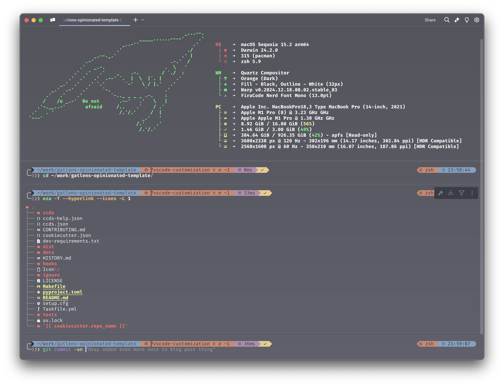
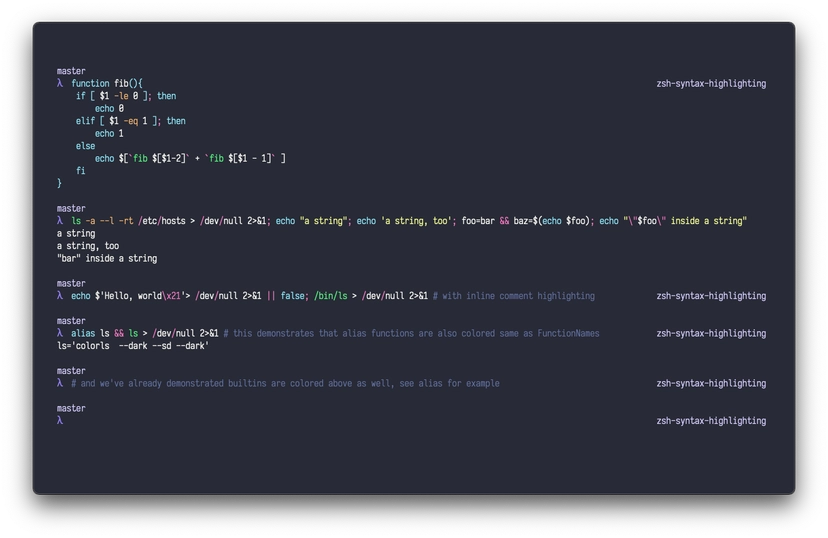
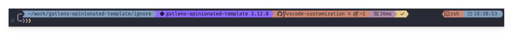
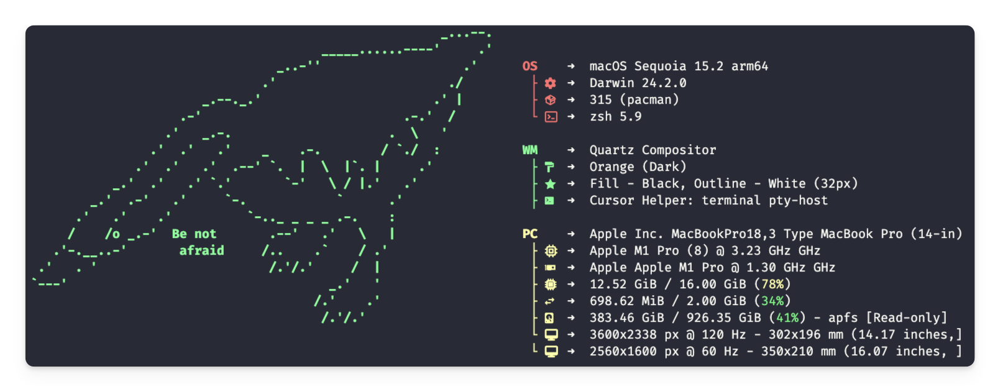

# chezmoi_dotfiles

Chezmoi is a dotfile manager. The name literally translates to "at my house"

# Gatlen's dotfiles

**_My `~/.config` macos configuration for nerdy things like zshrc and jazz_**

_Last updated: 2024 December 22_


<div align="center">
  <a href="https://dotfiles.github.io/">
    
  </a>
  <br/>
  <b>Gatlen's <a href="https://dotfiles.github.io/">dotfiles</a></b>
  <br/>
</div>
<br>

I love configuring my machine and tools to work exactly the way I want them to and decided to post my dotfiles to github for back-up/learning/sharing. Feel free to take any of this setup and make it your own.

This might not be the most useful way to spend my time but I find it kind of relaxing, similar to [bullet-journaling](https://hips.hearstapps.com/hmg-prod/images/img-20200415-110729-1586974804.jpg) but for software engineers and nerds.

<div align="center">
    
  <br/>
  My Full Terminal Configuration
  <br/>
</div>
<br>

## Quick Install

```bash
# Linux/Windows (VS Code)
sh -c "$(curl -fsLS get.chezmoi.io)" -- init --apply GatlenCulp --exclude=iterm2

# macOS
sh -c "$(curl -fsLS get.chezmoi.io)" -- init --apply GatlenCulp
```

⚠️ **Warning**: Review the code before installing! This is destructive and will modify your config files.

______________________________________________________________________

## Features 📦

### 00 Installers 🍺

<div align="center">
    
  <br/>
  Homebrew Logo
  <br/>
</div>
<br>

I tend to use [Homebrew](https://brew.sh/) for essentially everything where possible. Homebrew takes care of upgrades, uninstalls, etc. It's nice to keep things centralized like this. I don't have all my homebrew package/app installs here but might add them later. You can check out an incomplete set of apps I use [on stackshare](https://stackshare.io/gatlenculp/my-stack).

### 01 ZSH & BASH Setup 🐚

<div align="center">
    
  <br/>
  Zshell Logo
  <br/>
</div>
<br>

ZShell is my go-to since it's approximately fully-compatible with BASH and is default on MacOS. I do add some customizations to it though using [Oh My ZSH](https://ohmyz.sh/), the community go-to for ZSH plugins and configuration.

If a configuration is agnostic to BASH/ZSH, I just label it as `sh` instead of `zsh` or `bash`.

**Configuration Files:**

- [`.shrc`](./.shrc) and [`shrc/`](./shrc/) - General shell configuration. `.shrc` is the entry point which calls scripts in `shrc/`.
- [`.zshrc`](./.zshrc), [`zshrc/`](./zshrc/), [`.bashrc`](./.bashrc), and [`bashrc/`](./bashrc/) - Shell-specific configs.
- [`.exports`](./.exports) -- Global Environment Variables
- [`.aliases`](./.aliases) -- Command Aliases (basically short functions)
- [`.functions`](./.functions) -- Helper functions

The \[`.{bash_, z}profile`\] files are more for custom configs but honestly this is my own computer so there isn't much of a difference.

**Linking real and fake rcs**

BASH/ZSH don't use `~/.config/.{ba, z}shrc` for their rc files and instead use `~/.{ba, z}shrc`, so the real rc files just source my rc files in `~/.config`:

```bash
source $HOME/.config/.zshrc
```

I could symlink the files, but I lightly prefer this setup since many tools will ask you to add something to your rc file like `echo 'start tool' >> ~/.zshrc` and sometimes I'm lazy and will just do that and organize it into the proper place later when I decide I want to make it a part of my permanent config.

**Essential Extensions:**

**Autosuggestions Extension** - I don't know how I lived without this extension and syntax highlighting. They're godly. Check out [zsh-autosuggestions](https://github.com/zsh-users/zsh-autosuggestions).

**Syntax Highlighting Extension** - The [zsh-syntax-highlighting](https://github.com/zsh-users/zsh-syntax-highlighting/tree/master) extension highlights commands in terminal as you type them to help better parse the command and catch errors. I combine this with the [Dracula theme](https://draculatheme.com/zsh-syntax-highlighting).

<div align="center">
    
  <br/>
  Dracula Syntax Highlighting
  <br/>
</div>
<br>

**Other Shells I'm Exploring:**

I'm currently exploring other shells like [Nushell](https://www.nushell.sh/) (gorgeous, data-driven, and fast) and [Xonsh](https://xon.sh/) (Python shell, also wonderful).

I think [FISH](https://fishshell.com/) is nice but I've strayed away from it because if I'm going to use a shell that's POSIX incompatible and has some extra stuff to learn I might as well just jump to the most modern tooling I guess.

### 02 Fetch/Prompt Customization ❓

**Prompt:**

<div align="center">
    
  <br/>
  Gatlen's Prompt
  <br/>
</div>
<br>

I use [Oh My Posh](https://ohmyposh.dev/) for my command line prompt. I use this over [powerlevel10k](https://github.com/romkatv/powerlevel10k) (with [Oh My ZSH](https://ohmyz.sh/)) and more traditional tools because it's shell-independent, easily customizable, and well documented. I've used powerlevel and other tools prior to Oh My Posh and low-key they're bit annoying to setup.

Configuration can be found in [oh-my-posh](./oh-my-posh/). I'm currently using [nordcustom_v.3.omp.json](oh-my-posh/themes/nordcustom_v.3.omp.json)

More than just aesthetic, this helps me parse:

1. Whether the last command succeeded or failed
1. My current directory
1. How long the previous command took to run
1. What virtual environment or project I'm in
1. Separating different commands and their output
1. Tells me which git branch I'm on and what the status of my changes are compared to remote
1. More

<details>
<summary>Starship Alternative</summary>
Another alternative to Oh My Posh is [Starship](https://starship.rs/) which somehow got even more popular than Oh My Posh? It's very similar, I think is a bit faster and has some additional features or something but I haven't played with it and it wasn't around when I first made my prompt.
</details>

<br/>

**System Info Display:**

<div align="center">
    
  <br/>
  Gatlen's FastFetch
  <br/>
</div>
<br>

"Fetch-like" tools are command-line system information tools [rice](https://aesthetics.fandom.com/wiki/Linux_Ricing) freaks like me will put at the beginning of their prompt to mark the start of the terminal session and get some info about their machine.

Since the most popular [Neofetch](https://github.com/dylanaraps/neofetch) tool was discontinued, there have been an insane number of replacements since. I forget why I settled on FastFetch, but it's one of the popular ones. I stole configuration and ascii art from someone else.

### 03 Command Line Utilities 🛠️

- [thefuck](https://github.com/nvbn/thefuck) - Magnificent app which corrects your previous console command. (Config in [`thefuck/`](./thefuck/), granted I don't use this much but maybe should)
- [eza](https://github.com/eza-community/eza) - A modern alternative to ls (Config in [`eza/`](./eza/)) (This is really what ls should be. Prints an amazing tree with icons, syntax highlighting, and more. MWAH)
- [gh](https://cli.github.com/) - GitHub command line interface.
- [btop](https://github.com/aristocratos/btop) -- Gorgeous and extensive resource monitor and process manager. (Config [`btop`](./btop/))

There are a few other command line tools I have that are not listed here. These are just some ones in these dotfiles.

### 04 Nerd Font 💬

[Nerd Fonts](https://github.com/ryanoasis/nerd-fonts) is a project that patches developer targeted fonts with a high number of glyphs (icons). Specifically to add a high number of extra glyphs from popular 'iconic fonts' such as Font Awesome, Devicons, Octicons, and others.

[Fira Code Nerd Font](https://github.com/Trzcin/Fira-Code-Nerd) is my go-to font for literally everything. The monospace, ligatures, universal availability, and options just make it \*mwah\*. The ligatures are something I don't think I could live without now and make code so much easier to read.

<div align="center">
    
  <br/>
  Fira Code Ligatures
  <br/>
</div>
<br>

(Like Fira Code is literally on Google Fonts and you can use it as the default font in Google Colab. There's an extension for it in VSCode. It's just everywhere and I low-key love it so no complaints here.)

### 05 Theme 🎨

<div align="center">
    
</div>
<br>

I used OneDark on everything for such a long time and decided to switch it up and use [Dracula](https://draculatheme.com/). I slightly prefer Dracula now both for the theme itself and the cross-platform standardization available on the website for literally everything. I find standardizaion pretty important so I can quickly identify what is what.

My custom dracula themes are in [`dracula-theme/`](./dracula-theme)

### 06 Terminal & IDE 🖥️

For terminals, I mainly just use the Cursor/VScode integrated terminal. Otherwise I use [Warp](https://www.warp.dev/), a modern rust-based terminal with LLM agents and command with [iterm2](https://iterm2.com/) as backup.

I use [Cursor](https://www.cursor.com/) as my IDE, an LLM powered fork of [VSCode](https://code.visualstudio.com/) compatible with all the same settings and extensions. VSCode/Cursor is so compatible with everything out of the box and has a lot of nice features and gui and is easy to make extensions for and work remotely and work with jupyter notebooks and yada yada.

I don't really use the Jupyter Notebook or Lab GUI nor Google Colab primarily because I want to maintain all my VSCode/Cursor settings and use LLMs. If I need more compute for training models I tend to use [RunPod](https://www.runpod.io/) since it has pretty easy setup.

### 07 Misc Tools 🗃️

- [`crossnote`](./crossnote/) -- Mainly used for custom [VSCode Markdown Preview Enhanced](https://shd101wyy.github.io/markdown-preview-enhanced/) KaTeX/MathJax Rendering
- [`.tmux.conf`](./.tmux.conf) -- The popular [Tmux](https://github.com/tmux/tmux) Terminal multiplexer, never actually set anything up, will probably use [zellij](https://zellij.dev/) instead.
- [`cookiecutter`](./cookiecutter/) -- My [CookieCutter](https://www.cookiecutter.io/) saved config to speed up templating.

______________________________________________________________________

## Security 🔒

```
┌─○───┐
│ │╲  │
│ │ ○ │
│ ○ ░ │
└─░───┘
```

Since this is on my actual `~/.config` folder and god know what tool wants to save private info here, I try my best to keep secrets from accidentally getting uploaded publicly.

This repo is protected with [gitleaks](https://github.com/gitleaks/gitleaks) and [pre-commit](https://pre-commit.com/) hooks. I use an additive rather than subtractive strategy for my [.gitignore](./.gitignore) file, adding folders as needed.

## Copyright ©️

No private code is being posted here but this is a low-key project and I don't have time to make contributions to every tool I use or open-source repo I clone into it (ex: [Dracula themes](https://draculatheme.com/)). Feel free to take whatever you want from this repo and make it your own but I make no guarentees about its functionality or quality.

A decent chunk of these dotfiles were taken from another common dotfiles repo: https://github.com/mathiasbynens/dotfiles

I agree with the author here:

> Warning: If you want to give these dotfiles a try, you should first fork this repository, review the code, and remove things you don't want or need. Don't blindly use my settings unless you know what that entails. Use at your own risk!

## Chezmoi Reference

Chezmoi helps manage dotfiles across multiple machines with helpful templating and OS-specific configs.

### Chezmoi Stages

Reference [their overview page](https://www.chezmoi.io/user-guide/command-overview/)

### Go Templating Reference

Chezmoi uses [Go text templating](https://pkg.go.dev/text/template). [This guide](https://gohugo.io/templates/introduction/) is pretty nice.

You can see all the template data available by running `chezmoi data --format yaml`. These variables appear in two places:

- for all source files containing `*.tmpl`. When they are rendered all `{{ .chezmoi.some-variable }}` will be filled in.
- for all arguments to chezmoi commands. Ex: `chezmoi execute-template '{{ .chezmoi | toToml }}'`

You can feed files in:

```bash
chezmoi execute-template --init < '/Users/gat/.local/share/chezmoi/chezmoi.toml.tmpl'
```

Examples:

- `{{ $osid }}` outputs: linux-debian
- `{{ $osid | quote }}` outputs: "linux-debian"

## Random Notes 📝

<details>
<summary>Todo List ✅</summary>

- [ ] [rcm (rc file management)](https://github.com/thoughtbot/rcm) looks like an interesting tool but I just learned about it and not ready to go down another rabbit hole
- [ ] As mentioned above, I want to understand [Starship](https://starship.rs/)'s differences from [Oh My Posh](https://ohmyposh.dev/)
- [ ] Not a huge fan of the right-side second prompt since it breaks after resizing the terminal window. Might remove.
- [ ] Try out the terminal multiplexer [Zellij](https://zellij.dev/) more. I never really got into terminal multiplexing and since I use VSCode/Cursor for my programming, I have always had windows to drag around so I don't know if I actually need it. I have config in [`zellij/`](./zellij/) but haven't decided whether to set it up.

</details>

<details>
<summary>Why Not Vim 🤡</summary>

I tried getting into [[Neo]Vim](https://neovim.io/) back in high school and installing extension after extension to make it usable and learning all the commands but it was such a rabbit hole and I don't know if I want to get into it again. Especially since VSCode/Cursor is so compatible with everything out of the box and has a lot of nice features and gui and is easy to make extensions for and work remotely and work with jupyter notebooks and yada yada.

There's a ton of "post-modern" Vim-like terminal-based tools like [Helix](https://helix-editor.com/) as well as preconfigured Neovim IDE distributions (ex: [LunarVim](https://www.lunarvim.org/), [NvChad](https://nvchad.com/), [AstroVim](https://astronvim.com/), and [LazyVim](https://www.lazyvim.org/)) and I don't think this is the worst time to get into this but god damn is it a time sink. I don't know what the ecosystem looks like now but I remember if you wanted to download plugins you had to choose between 8 different Vim package managers and if you wanted to write a plugin you had to use [VimScript](https://learnvimscriptthehardway.stevelosh.com/): a whole ass ugly language JUST for writing plugins. Considering the inevitability of having to do some amount of editing via the command line I might install LunarVim just for that.

</details>

## Brewfile

See [https://github.com/Homebrew/homebrew-bundle](https://github.com/Homebrew/homebrew-bundle).
TODO: Figure out whether the rayconfig file for raycast contains sensitive information
