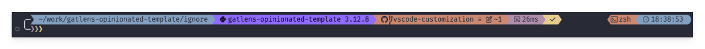

# Gatlen's dotfiles

**_My `~/.config` macos configuration for nerdy things like zshrc and jazz_**

_Last updated: 2024 December 22_

  
   
  <b>Gatlen's <a href="https://dotfiles.github.io/">dotfiles</a></b>
   

 

I love configuring my machine and tools to work exactly the way I want them to and decided to post my dotfiles to github for back-up/learning/sharing. Feel free to take any of this setup and make it your own.

This might not be the most useful way to spend my time but I find it kind of relaxing, similar to [bullet-journaling](https://hips.hearstapps.com/hmg-prod/images/img-20200415-110729-1586974804.jpg) but for software engineers and nerds.

## Features

### 00 Installers

I tend to use [Homebrew](https://brew.sh/) for essentially everything where possible. Homebrew takes care of upgrades, uninstalls, etc. It's nice to keep things centralized like this. I don't have all my homebrew package/app installs here but might add them later. You can check out an incomplete set of apps I use [on stackshare](https://stackshare.io/gatlenculp/my-stack).

### 01 ZSH & BASH Setup

ZShell is my go-to since it's approximately fully-compatible with BASH and is default on MacOS. I do add some customizations to it though using [Oh My ZSH](https://ohmyz.sh/).

[.exports](./.exports) -- Global Environment Variables

**Other Shells**

I'm currently exploring other shells like [Nushell](https://www.nushell.sh/) (gorgeous, data-driven, and fast) and [Xonsh](https://xon.sh/) (Python shell, also wonderful).

I think [FISH](https://fishshell.com/) is nice but I've strayed away from it because if I'm going to use a shell that's POSIX incompatible and has some extra stuff to learn I might as well just jump to the most modern tooling I guess.

### 02 Prompt Customization

    
   
  Gatlen's Prompt
   

 

I use [Oh My Posh](https://ohmyposh.dev/) for my command line prompt. I use this over [powerlevel10k](https://github.com/romkatv/powerlevel10k) (with [Oh My ZSH](https://ohmyz.sh/)) and more traditional tools because it's shell-independent, easily customizable, and well documented. I've used powerlevel and other tools prior to Oh My Posh and low-key they're bit annoying to setup.

Another alternative to Oh My Posh is [Starship](https://starship.rs/) which somehow got even more popular than Oh My Posh? It's very similar, I think is a bit faster and has some additional features or something but I haven't played with it and it wasn't around when I first made my prompt.

Configuration can be found in [oh-my-posh](./oh-my-posh/). I'm currently using [nordcustom_v.3.omp.json](oh-my-posh/themes/nordcustom_v.3.omp.json)

## Security

Since this is on my actual `~/.config` folder and god know what tool wants to save private info here, I try my best to keep secrets from accidentally getting uploaded publicly.

This repo is protected with [gitleaks](https://github.com/gitleaks/gitleaks) and [pre-commit](https://pre-commit.com/) hooks. I use an additive rather than subtractive strategy for my [.gitignore](./.gitignore) file, adding folders as needed.

## Copyright

No private code is being posted here but this is a low-key project and I don't have time to make contributions to every tool I use or open-source repo I clone into it (ex: [Dracula themes](https://draculatheme.com/)). Feel free to take whatever you want from this repo and make it your own but I make no guarentees about its functionality or quality.

A decent chunk of these dotfiles were taken from another common dotfiles repo: https://github.com/mathiasbynens/dotfiles
