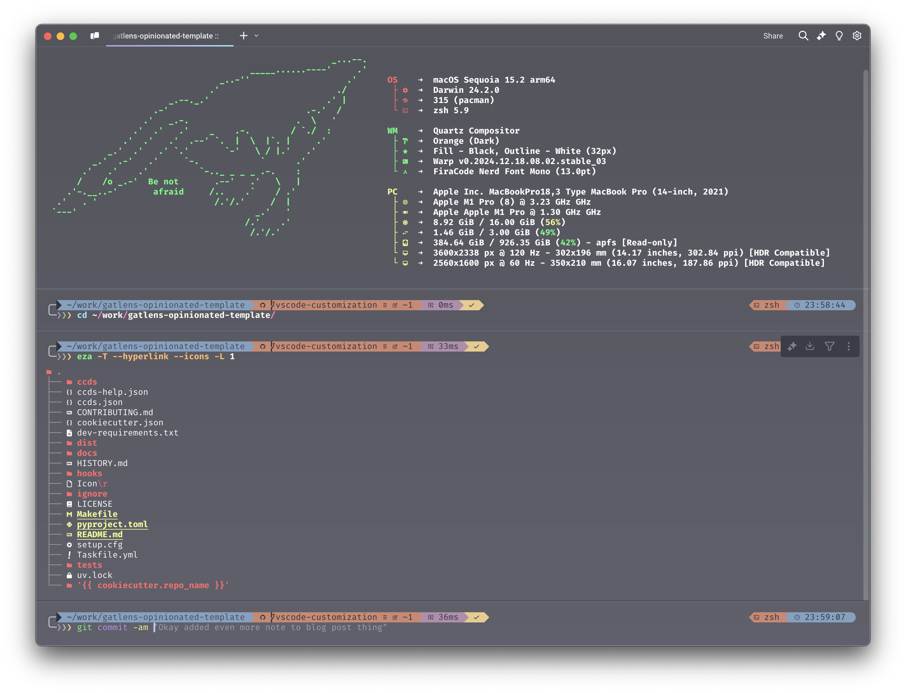
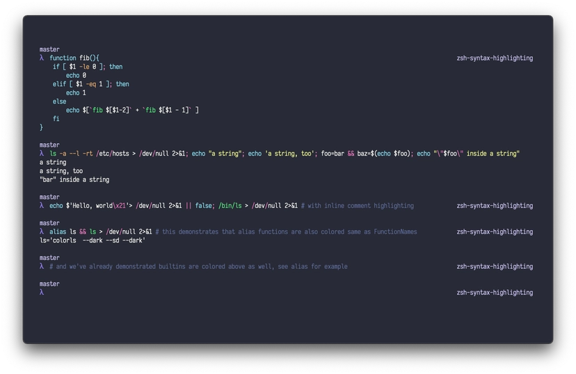

# Gatlen's dotfiles

**_My `~/.config` macos configuration for nerdy things like zshrc and jazz_**

_Last updated: 2024 December 22_


<div align="center">
  <a href="https://dotfiles.github.io/">
    
  </a>
  <br/>
  <b>Gatlen's <a href="https://dotfiles.github.io/">dotfiles</a></b>
  <br/>
</div>
<br>

I love configuring my machine and tools to work exactly the way I want them to and decided to post my dotfiles to github for back-up/learning/sharing. Feel free to take any of this setup and make it your own.

This might not be the most useful way to spend my time but I find it kind of relaxing, similar to [bullet-journaling](https://hips.hearstapps.com/hmg-prod/images/img-20200415-110729-1586974804.jpg) but for software engineers and nerds.

<div align="center">
    
  <br/>
  My Full Terminal Configuration
  <br/>
</div>
<br>

To install, run [`install.sh`](./install.sh). BE CAREFUL! This is destructive. (And also doesn't work rn)

---

## Features 📦

### 00 Installers 🍺

<div align="center">
    
  <br/>
  Homebrew Logo
  <br/>
</div>
<br>

I tend to use [Homebrew](https://brew.sh/) for essentially everything where possible. Homebrew takes care of upgrades, uninstalls, etc. It's nice to keep things centralized like this. I don't have all my homebrew package/app installs here but might add them later. You can check out an incomplete set of apps I use [on stackshare](https://stackshare.io/gatlenculp/my-stack).

### 01 ZSH & BASH Setup 🐚

<div align="center">
    
  <br/>
  Zshell Logo
  <br/>
</div>
<br>

ZShell is my go-to since it's approximately fully-compatible with BASH and is default on MacOS. I do add some customizations to it though using [Oh My ZSH](https://ohmyz.sh/), the community go-to for ZSH plugins and configuration.

If a configuration is agnostic to BASH/ZSH, I just label it as `sh` instead of `zsh` or `bash`.

[`.shrc`](./.shrc) and [`shrc/`](./shrc/) - General shell configuration. `.shrc` is the entry point which calls scripts in `shrc/`.

[`.zshrc`](./.zshrc), [`zshrc/`](./zshrc/), [`.bashrc`](./.bashrc), and [`bashrc/`](./bashrc/) are the same but shell-specific. These rc files call `.shrc` for general setup.

[`.exports`](./.exports) -- Global Environment Variables
[`.aliases`](./.aliases) -- Command Aliases (basically short functions)
[`.functions`](./.functions) -- Helper functions

The [`.{bash_, z}profile`] files are more for custom configs but honestly this is my own computer so there isn't much of a difference

**Linking real and fake rcs**

BASH/ZSH don't use `~/.config/.{ba, z}shrc` for their rc files and instead use `~/.{ba, z}shrc`, so the real rc files just source my rc files in `~/.config`:

```bash
source $HOME/.config/.zshrc
```

I could symlink the files, but I lightly prefer this setup since many tools will ask you to add something to your rc file like `echo 'start tool' >> ~/.zshrc` and sometimes I'm lazy and will just do that and organize it into the proper place later when I decide I want to make it a part of my permanent config.

**Autosuggestions Extension**
I don't know how I lived without this extension and syntax highlighting. They're godly.

Check out [zsh-autosuggestions](https://github.com/zsh-users/zsh-autosuggestions)


**Syntax Highlighting Extension**


The [zsh-syntax-highlighting](https://github.com/zsh-users/zsh-syntax-highlighting/tree/master) extension highlights commands in terminal as you type them to help better parse the command and catch errors. I combine this with the [Dracula theme for this specific extension](https://draculatheme.com/zsh-syntax-highlighting)

<div align="center">
    
  <br/>
  Dracula Syntax Highlighting
  <br/>
</div>
<br>


**Other Shells**

I'm currently exploring other shells like [Nushell](https://www.nushell.sh/) (gorgeous, data-driven, and fast) and [Xonsh](https://xon.sh/) (Python shell, also wonderful).

I think [FISH](https://fishshell.com/) is nice but I've strayed away from it because if I'm going to use a shell that's POSIX incompatible and has some extra stuff to learn I might as well just jump to the most modern tooling I guess.

### 02 Fetch/Prompt Customization ❓

**Prompt**

<div align="center">
    
  <br/>
  Gatlen's Prompt
  <br/>
</div>
<br>

I use [Oh My Posh](https://ohmyposh.dev/) for my command line prompt. I use this over [powerlevel10k](https://github.com/romkatv/powerlevel10k) (with [Oh My ZSH](https://ohmyz.sh/)) and more traditional tools because it's shell-independent, easily customizable, and well documented. I've used powerlevel and other tools prior to Oh My Posh and low-key they're bit annoying to setup.

Configuration can be found in [oh-my-posh](./oh-my-posh/). I'm currently using [nordcustom_v.3.omp.json](oh-my-posh/themes/nordcustom_v.3.omp.json)

More than just aesthetic, this helps me parse:
1. Whether the last command succeeded or failed
2. My current directory
3. How long the previous command took to run
4. What virtual environment or project I'm in
5. Separating different commands and their output
6. Tells me which git branch I'm on and what the status of my changes are compared to remote
7. More

<details>
<summary>Starship Alternative</summary>
Another alternative to Oh My Posh is [Starship](https://starship.rs/) which somehow got even more popular than Oh My Posh? It's very similar, I think is a bit faster and has some additional features or something but I haven't played with it and it wasn't around when I first made my prompt.
</details>

<br/>

**Fetch**

<div align="center">
    
  <br/>
  Gatlen's FastFetch
  <br/>
</div>
<br>

"Fetch-like" tools are command-line system information tools [rice](https://aesthetics.fandom.com/wiki/Linux_Ricing) freaks like me will put at the beginning of their prompt to mark the start of the terminal session and get some info about their machine.

Since the most popular [Neofetch](https://github.com/dylanaraps/neofetch) tool was discontinued, there have been an insane number of replacements since. I forget why I settled on FastFetch, but it's one of the popular ones. I stole configuration and ascii art from someone else.


### 03 Command Line Utilities 🛠️

- [thefuck](https://github.com/nvbn/thefuck) - Magnificent app which corrects your previous console command. (Config in [`thefuck/`](./thefuck/), granted I don't use this much but maybe should)
- [eza](https://github.com/nvbn/thefuck) - A modern alternative to ls (Config in [`eza/`](./eza/)) (This is really what ls should be. Prints an amazing tree with icons, syntax highlighting, and more. MWAH)
- [gh](https://cli.github.com/) - GitHub command line interface.
- [btop](https://github.com/aristocratos/btop) -- Gorgeous and extensive resource monitor and process manager. (Config [`btop`](./btop/))

There are a few other command line tools I have that are not listed here. These are just some ones in these dotfiles.

### 04 Nerd Font 💬

[Nerd Fonts](https://github.com/ryanoasis/nerd-fonts) is a project that patches developer targeted fonts with a high number of glyphs (icons). Specifically to add a high number of extra glyphs from popular 'iconic fonts' such as Font Awesome, Devicons, Octicons, and others.

[Fira Code Nerd Font](https://github.com/Trzcin/Fira-Code-Nerd) is my go-to font for literally everything. The monospace, ligatures, universal availability, and options just make it \*mwah\*. The ligatures are something I don't think I could live without now and make code so much easier to read.

<div align="center">
    
  <br/>
  Fira Code Ligatures
  <br/>
</div>
<br>

(Like Fira Code is literally on Google Fonts and you can use it as the default font in Google Colab. There's an extension for it in VSCode. It's just everywhere and I low-key love it so no complaints here.)

### 05 Theme 🎨

<div align="center">
    
</div>
<br>


I used OneDark on everything for such a long time and decided to switch it up and use [Dracula](https://draculatheme.com/). I slightly prefer Dracula now both for the theme itself and the cross-platform standardization available on the website for literally everything. I find standardizaion pretty important so I can quickly identify what is what.

My custom dracula themes are in [`dracula-theme/`](./dracula-theme)

### 06 Terminal 🖥️

I mainly just use the Cursor/VScode integrated terminal. Otherwise I use [Warp](https://www.warp.dev/), a modern rust-based terminal with LLM agents and command with [iterm2](https://iterm2.com/) as backup.

### 07 IDE 💻

I use [Cursor](https://www.cursor.com/), an LLM powered fork of [VSCode](https://code.visualstudio.com/) compatible with all the same settings and extensions. VSCode/Cursor is so compatible with everything out of the box and has a lot of nice features and gui and is easy to make extensions for and work remotely and work with jupyter notebooks and yada yada.

I don't really use the Jupyter Notebook or Lab GUI nor Google Colab primarily because I want to maintain all my VSCode/Cursor settings and use LLMs. If I need more compute for training models I tend to use [RunPod](https://www.runpod.io/) since it has pretty easy setup.


### 08 Misc 🗃️

- [`crossnote`](./crossnote/) -- Mainly used for custom [VSCode Markdown Preview Enhanced](https://shd101wyy.github.io/markdown-preview-enhanced/) KaTeX/MathJax Rendering
- [`.tmux.conf`](./.tmux.conf) -- The popular [Tmux](https://github.com/tmux/tmux) Terminal multiplexer, never actually set anything up, will probably use [zellij](https://zellij.dev/) instead.
- [`cookiecutter`](./cookiecutter/) -- My [CookieCutter](https://www.cookiecutter.io/) saved config to speed up templating.


---

## Security 🔒

```
┌─○───┐
│ │╲  │
│ │ ○ │
│ ○ ░ │
└─░───┘
```

Since this is on my actual `~/.config` folder and god know what tool wants to save private info here, I try my best to keep secrets from accidentally getting uploaded publicly.

This repo is protected with [gitleaks](https://github.com/gitleaks/gitleaks) and [pre-commit](https://pre-commit.com/) hooks. I use an additive rather than subtractive strategy for my [.gitignore](./.gitignore) file, adding folders as needed.

## Copyright ©️

No private code is being posted here but this is a low-key project and I don't have time to make contributions to every tool I use or open-source repo I clone into it (ex: [Dracula themes](https://draculatheme.com/)). Feel free to take whatever you want from this repo and make it your own but I make no guarentees about its functionality or quality.

A decent chunk of these dotfiles were taken from another common dotfiles repo: https://github.com/mathiasbynens/dotfiles

I agree with the author here:

> Warning: If you want to give these dotfiles a try, you should first fork this repository, review the code, and remove things you don’t want or need. Don’t blindly use my settings unless you know what that entails. Use at your own risk!

## Random Notes 📝

<details>

<summary>
00 To do/try ✅
</summary>

### 00 To do/try ✅

- [ ] [rcm (rc file management)](https://github.com/thoughtbot/rcm) looks like an interesting tool but I just learned about it and not ready to go down another rabbit hole
- [ ] As mentioned above, I want to understand [Starship](https://starship.rs/)'s differences from [Oh My Posh](https://ohmyposh.dev/)
- [ ] Not a huge fan of the right-side second prompt since it breaks after resizing the terminal window. Might remove.
- [ ] Try out the terminal multiplexer [Zellij](https://zellij.dev/) more. I never really got into terminal multiplexing and since I use VSCode/Cursor for my programming, I have always had windows to drag around so I don't know if I actually need it. I have config in [`zellij/`](./zellij/) but haven't decided whether to set it up.

</details>

<details>

<summary>
01 Why Not Vim 🤡
</summary>

### 01 Why Not Vim 🤡

I tried getting into [[Neo]Vim](https://neovim.io/) back in high school and installing extension after extension to make it usable and learning all the commands but it was such a rabbit hole and I don't know if I want to get into it again. Especially since VSCode/Cursor is so compatible with everything out of the box and has a lot of nice features and gui and is easy to make extensions for and work remotely and work with jupyter notebooks and yada yada.

There's a ton of "post-modern" Vim-like terminal-based tools like [Helix](https://helix-editor.com/) as well as preconfigured Neovim IDE distributions (ex: [LunarVim](https://www.lunarvim.org/), [NvChad](https://nvchad.com/), [AstroVim](https://astronvim.com/), and [LazyVim](https://www.lazyvim.org/)) and I don't think this is the worst time to get into this but god damn is it a time sink. I don't know what the ecosystem looks like now but I remember if you wanted to download plugins you had to choose between 8 different Vim package managers and if you wanted to write a plugin you had to use [VimScript](https://learnvimscriptthehardway.stevelosh.com/): a whole ass ugly language JUST for writing plugins. Considering the inevitability of having to do some amount of editing via the command line I might install LunarVim just for that.

</details>

<details>
<summary>
02 What's up with Rust? 🦀 (Warning this should have been a blogpost)
</summary>

### 02 What's up with Rust? 🦀

[Rust](https://www.rust-lang.org/) has been getting really popular as of late and I see a lot of people annoyed at how much hype online it's been getting, calling it convoluted, a fad, or \<insert some other derogatory statement\>. There's a large chunk of people who will simply use or convert to any tool written in Rust because it's "fast" and "safe".

**Rust Background**

I think it's worth looking into Rust if you aren't already familiar with the language. I don't know much about it other than the community is extremely active, the language is super fast, memory-safe, easy-to-debug (by turning runtime-errors into compile-time errors), and has both high-level python-like syntax as well as low-level C++-like syntax and capabilities, making it pretty easy to work on multiple levels of abstraction. The tooling ecosystem has been exploding and it has phenomenal bindings to other languages (I'm specifically thinking about [Python](https://pyo3.rs/v0.23.3/)) making it a common choice for efficient libraries. It seems like there is some dissatisfaction around parts of the langauge (infamously: strings) but I get the vibe this has more to do with newbies being confused with the options and norms not yet being established with this language being so new.

**It's becoming a modern standard**

It seems like an exciting langauge and I've been hesitant about the hype since it could just be a fad. My hesitancy has almost all but disappeared as it has grown even more and as I search for tools, packages, for python, or whatever else -- I've found that almost every modern, well-documented, fast, and gorgeous tool is [Rust-based](https://github.com/rust-unofficial/awesome-rust) or Go-Based. For Python: Pydantic, FastAPI, ruff, uv, and polars. General tools: Helix, Warp, Zellij, LanceDB, Neon, and more. These are generally becoming standard and these are just ones that come off the top of my head. I've also heard about parts of Operating Systems being written in rust.


I was never really a Rust simp but now, as soon as I learn that was some library was written in Rust it is almost always the case that (1) It is fast (2) It has great syntax, design patterns, and clear errors (3) It has great documentation (4) It has great support and a great community (5) It is simply a better version of some other package built from the ground up. I'm becoming increasingly optimistic about Rust's place in the modern software ecosystem and its continued integration in Python, whose design pattern is mainly "import package that already does it and run a function". Python has kind of become a go-to abstraction language for powerful functionality written in other languages. Whenever I start a Python Project, I'm probably running more Rust than Python.

**Thoughts on the Field of SWE -- Abstraction, Maturity, and Dependency**

It's also a bit refreshing to see a new-found focus on efficiency since a lot of modern apps and websites ([Electron](https://preview.redd.it/4ws3aotwfgr41.png?auto=webp&s=1a874789d6113451a390e84b5fd479709d67a71e), [Chrome](https://blogs.uww.edu/iknowhatyoumeme/files/2019/02/meme-for-first-review.jpg) -- I see u 👀) are so ridiculously bloated and [slow](https://programmerhumor.io/wp-content/uploads/2022/11/programmerhumor-io-linux-memes-backend-memes-e036df440b87307.jpg). Granted, they are ridiculously cross platform and easier to work with than something like C++ due to their abstraction. I feel like in the past few years there's been this weird transition from "we are tired of the hard low-level languages, we wrote this abstract expensive langauge that is easy to code in" (think JavaScript and Python) to "oh but now we need to make big projects and some of the language's strictness was nice" (Think TypeScript which LITERALLY FUCKING COMPILES TO THE TYPELESS DEMON KNOWN AS JAVASCRIPT and Python Type annotations/checkers) in addition to the languages being slow as balls. Now it feels like we are wrapping around to combine the two since a lot of modern devs want to make projects other than web apps and scripts but literally only know Python and Javascript and the transition to C++ is kinda of hellish and filled with unclear documentation, packages, and standards sometimes modern sometimes from the 1970s. There's no reason why it has to be this hard.

Correct me if I'm wrong but we have gone from

1. Assembly abstracted to C
2. C extended/abstracted to C++
3. C++ abstracted to Javascript V8 Engine
4. Javascript V8 Engine extended to Node.js for local development
5. Node.js JavaScript structured into TypeScript pre-compiler
6. Entire TypeScript package ecosystem developed in NPM
7. Using TypeScript + NPM packages with insane dependency stacks and Frameworks like React. This is one of the most common ways to make projects today.


Let me be clear, I recognize abstraction/extension is the natural progression of software and healthy. I'm not being a boomer saying "these spoiled kiddos don't know how to code in proper Assembly Code." I've written maybe a hundred lines of C++ in my life and I'm not one to talk. Abstraction/extension lowers the bar for others to come in and generally makes it possible for more powerful and scalable projects to come in. I mean hell, I'm typing this up in Cursor/VSCode, an app written in TypeScript. The first programming language I actually became fluent in was Python and I love a lot about it.

Part of the downside to this though is that these levels of abstraction/extension/history/popularity comes with a lot of baggage, legacy, and needed context. Kind of like how evolution could not have developed a car since it can only make genetic changes in small, incremental changes, I believe some things in software are hard to do if you continue building it in a legacy ecosystem and sometimes the way to move forwared is to tear it all down and start from scratch. While C/C++ are skillfully crafted languages, the creators could not have envisioned the world of software, hardware, and technology today nor the design patterns, philosophies, issues, and funding that have come from years of SWE. And had they been able to take advantage of these things, a different language would have been constructed. Additionally, there is certainly a computation cost from having to go through multiple layers of abstraction.

It feels like software engineering has become a mature field that has seen a lot and learned a lot from generations of developers and philosophies. Whereas problems have historically been fixed by adding another layer of abstraction or another library, it seems like a separate direction of "lets tear it all down and start fresh with the decades of knowledge we have acquired, free of legacy practices, packages, syntax, and more."

In a way I see these GO and Rust as a kind of "flattening" of the large dependency stack SWE made for itself, starting from scratch and writing something that's not really abstracted or pre-compiled, but clean and starting off on the right foot. Idk if a lot of that made sense.

**Reasons to continue being Rust-skeptical + Benefits of "Burn it down" mentality**

While Rust might still be awesome, there are some other possible contributions to by observations.

1. There is a self-selection bias -- Ambitious programmers tend to learn and program in new languages, so the distribution of Rust tooling leans towards being higher quality even if the language itself might not be better.
2. Breaking free from suboptimal standards -- It's often the case that communities hold onto the legacy established packages and standards in order to maintain compatability with old software and senior engineers that are stuck in their ways. Python is developed so fast that for most standard libraries and practices there exist better alternatives that often go unused (pandas vs polars, os vs pathlib, matplotlib vs seaborn, typing, setuptools vs pyproject.toml, "%s" format vs fstrings, tqdm vs rich.progress, json vs orjson, typed dict vs pydantic, etc.). If a Python clone called SnakeBoy was created, only it outlawed old standards and somehow became popular -- I think generally better projects would come out of it than Python but not for any reason surrounding compatabilities of the language. In terms of formatting itself there exist tons of QA tools and plugins and libraries that one has to be aware of instead of these just being a normal part of the language making it such that part of being a "mature developer" means knowing what the best tools out there are at the time. Also they have the benefit of all working together.
3. The "Unity" Problem -- Unity is a 3D/2D game engine and probably one of the most popular out there. It's very powerful and fairly easy to use but has a reputation of being an enginer for trashy games. When looking into this, I remember coming across someone who said that it's not actually a bad engine and they think it's probably better than Unreal Engine, it's competitor. Their explanation for this reputation is "Once a tool becomes popular and easy to use enough, the community can sometimes suffer from an onslaught of novices, bad content, and bad recommendations." I think this comes up a bit as it applies to the Python ecosystem. Since it is so easy to use and publish, there are tons of great tools out there but also a lot of awful ones. Separating wheat from chaff becomes difficult. Perhaps Rust being as difficult as it is to learn contributes to the positive connotations around what comes out of it.

</details>


## Brewfile

See [https://github.com/Homebrew/homebrew-bundle](https://github.com/Homebrew/homebrew-bundle). 